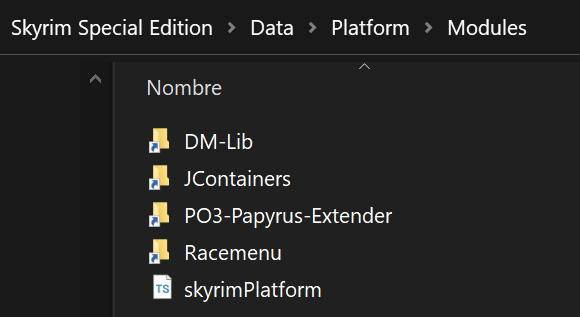

# Papyrus-2-Typescript

Converts Papyrus *.psc header files to *.ts files ready to use in Skyrim Platform.

## About

This program is meant to be used to transform SKSE definition libraries to Typescript for using them in [Skyrim Platform][], so you can use in Typescript all your SKSE libraries the same way you would be using them in Papyrus.

**_This program's aim is not to automate whole language features translation_**, but only function headers. \
If the \*.psc file contains actual code (think [PapyrusUtil.psc][papyrusutil]) the function header will be converted, but the rest will be output verbatim, waiting for a human to come and fix it.

## Usage

Drag and drop all your _.psc files to the executable.\
It will generate _.ts files in the same folder as its input.

## Using converted files

Put all your converted files inside some folder, then add that folder inside the folder where `skyrimPlatform.ts` is located.



Folders in this image look like shortcuts because they are actually [symlinks][] (the same technology Vortex uses to manage your mods).

You don't need to use symlinks. You can just drop your folders there.

Once folders are where they are supposed to be, import modules from Typescript as usual.

```typescript
import { on } from "skyrimPlatform"
import * as JArray from "JContainers/JArray"

// Lines irrelevant to our illustration purposes were ommited.

on("update", () => {
  const a = JArray.object()
  JArray.addInt(a, 5)
  const t: number = JArray.getInt(a, 0)

  // This outputs `5`, indeed.
  printConsole(`Array value: ${t}`)
})
```

I've added to this project some converted files for libraries I use myself. Grab them at the [conversions][] folder.

**_BEWARE_**: Not all functions have been tested.

## Remarks

This program has no way to know the intention of the humans that made the scripts, so it's always advisable to manually check all generated files to make sure everything is declared as it should.

Take note ⚠️the program assumes generated scripts will be put in some subfolder to the folder where `skyrimPlatform.ts` is found⚠️, otherwise you'll get `"Cannot find module..."` type of errors when coding your plugin.

If you want to have your scripts in some other place, you can always just change the relative path of each `import` for each \*.ts file, of course.

## Building

Build in release mode:

    nimble build -d:release "Papyrus_2_Typescript.exe"

Run test once compiled:

    .\Papyrus_2_Typescript.exe "TestScript.psc"

Compile in debug mode and run test:

    nimble run "Papyrus_2_Typescript.exe" "TestScript.psc"

[conversions]: /conversions/
[delphi community edition]: https://www.embarcadero.com/products/delphi/starter/free-download
[papyrusutil]: https://www.nexusmods.com/skyrimspecialedition/mods/13048
[skyrim platform]: https://www.nexusmods.com/skyrimspecialedition/mods/54909
[symlinks]: https://www.howtogeek.com/howto/16226/complete-guide-to-symbolic-links-symlinks-on-windows-or-linux/

[nim-regex]: https://github.com/nitely/nim-regex
[wNim]: https://github.com/khchen/wNim